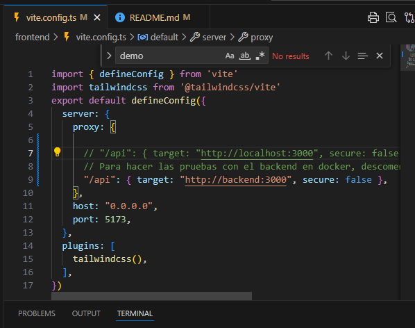
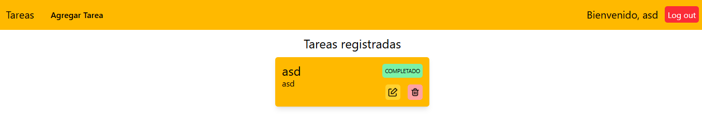
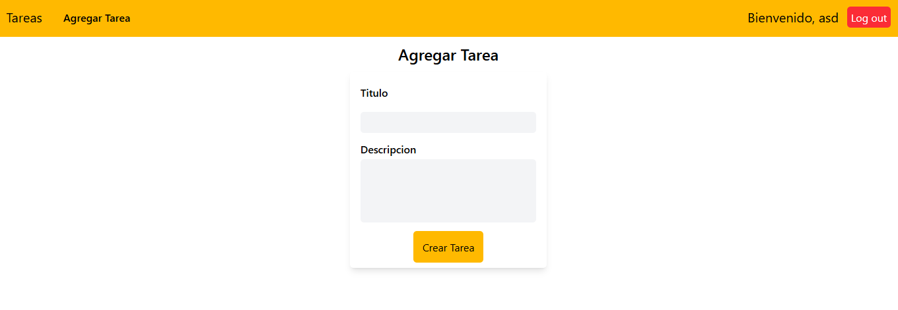
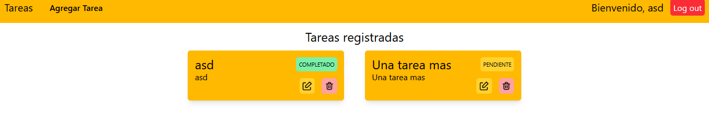
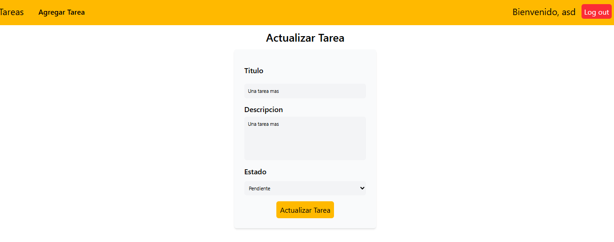
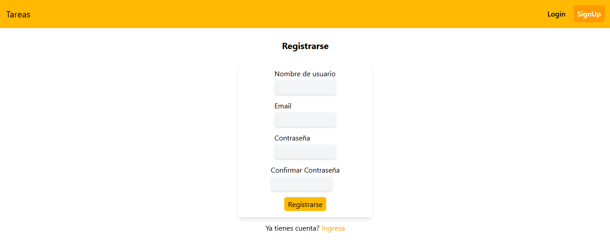

# Título del Proyecto

Prueba tecnica de Gux para Mid level Full Stack developer

## Comenzando 🚀

Descarga el repo

### Pre-requisitos 📋

Programas / dependencias necesarias

```
* Node
* Docker
* Vite
* VSCode
```

### Instalación 🔧

El programa se puede ejecutar usando docker-compose o en desarrollo. para ambas se necesita docker

#### 1. Docker compose

Ubicarse en la raiz del proyecto y ejecutar:

```
docker compose up --build
```

Una vez terminado, entrar a el enlace

```
http://localhost:5173/
```

#### 2. Entorno desarrollo


#### Base de datos

Levantar el container que contiene la base de datos

```
docker container run  -p 5440:5432 -e POSTGRES_DB=GUX -e POSTGRES_USER=GUX -e POSTGRES_PASSWORD=GUX -e POSTGRES_PORT=5440   --name postgres postgres
```
##### Frotend

Ubicado en la carpeta raiz ejecutar en consola con permisos de admin

```
cd .\frontend\
npm i
npm run dev
```

##### Backedn

Ubicado en la carpeta raiz ejecutar en consola con permisos de admin

```
cd .\backend\
npm i
npm run dev
```


### Consideraciones

 - El puerto para la base de datos debe ser el mismo que en ./backend/.env  (se utiliza 5440 para evitar conflictos)
 - Se dispone intencionalmente de los .env.template con sus respectivos datos para hacer las pruebas
 - En las pruebas con docker-compose, se debe redigir al nombre del servicio en la red como se describe en vite.config.ts
 (Ver imagen a continuacion)
 

### DEMO











## Pendientes ...


- Pruebas unitarias en Jest
- Implementacion de middleware para validacion de jwt (por temas de tiempo se dejo el boilerplate en cada controlador)
- CI/CD en github para la imagen


## Construido con 🛠️

- [NPM](https://www.npmjs.com/) - Gestor de paquetes
- [Vite](https://vite.dev/) - Servidor desarrollo
- [React](https://es.react.dev/) - Libreria JS
- [Node](https://nodejs.org/en) - Runtime JS
- [PostgreSQL](https://www.postgresql.org/) - Base de datos
- [Docker](https://www.docker.com/) - Containers
- [Prisma](https://www.prisma.io/) - ORM
- [TailwindCSS](https://tailwindcss.com/) - Framework CSS
- [Zustand](https://zustand-demo.pmnd.rs/) - Gestor de estados
- [TailwindCSS](https://tailwindcss.com/) - Framework CSS


## Versionado 📌

Usamos [GIT](http://github.com/) para el versionado, directo en rama master. Por temas practicos, no me guie en Gitflow
## Autores ✒️

- **Sebastian Monsalve** - Desarrollo full stack - [Seba Monsalve](https://github.com/Seba-Monsalve)

## Expresiones de Gratitud 🎁

- A [Villanuevand](https://github.com/Villanuevand) por esta genial plantilla de readme

---
